# Mini Project: Advanced GitOps Techniques

## Module 5: Advanced GitOps Techniques and Real-World Scenarios

This project implements multi-cluster deployments, microservices architectures, and CI/CD pipeline integration using ArgoCD on AWS EKS. It focuses on Advanced GitOps techniques using Argo CD, with an emphasis on real-world Kubernetes deployment scenarios.

---

## Architecture Overview

- **Cloud Provider:** AWS (us-east-1)
- **Kubernetes:** Two EKS clusters (primary + secondary, v1.29)
- **GitOps Tool:** ArgoCD (installed on primary cluster, managing both)
- **IaC:** Terraform (VPC + dual EKS provisioning)
- **CI/CD:** GitHub Actions → Docker Hub → ArgoCD auto-sync
- **Container Registry:** Docker Hub

---

## Prerequisites

- AWS CLI configured with a named profile (`samjean`)
- Terraform >= 1.5
- kubectl
- ArgoCD CLI
- Docker Hub account with access token
- GitHub repo with Actions secrets configured

---

## Project Structure

```
gitops-advanced/
├── terraform/
│   ├── main.tf              # VPC + dual EKS cluster definitions
│   ├── providers.tf         # AWS provider config
│   └── outputs.tf           # Cluster name outputs
├── applications/
│   ├── app-primary.yaml     # ArgoCD Application for dev (primary cluster)
│   └── app-secondary.yaml   # ArgoCD Application for prod (secondary cluster)
├── environments/
│   ├── dev/
│   │   └── deployment.yaml  # Dev environment manifests
│   └── prod/
│       └── deployment.yaml  # Prod environment manifests
├── shared-components/
│   └── service.yaml         # Shared Kubernetes Service definition
├── Dockerfile               # App container definition
└── .github/
    └── workflows/
        └── build-and-push.yml  # CI/CD pipeline
```

## Learning Outcome
By the end of this module, learners will be equipped to:

- Manage complex Kubernetes deployments using GitOps principles
- Deploy and operate applications across multiple clusters
- Handle microservices-based architectures with Argo CD
- Integrate Argo CD into CI/CD pipelines for automated delivery


## Lesson 5.1: Deploying Multiple Clusters and Microservices Architecture with Argo CD
### Objectives
- Develop proficiency in deploying applications across multiple Kubernetes clusters
- Manage complex microservices architectures using Argo CD
  
* Step 1: Setting Up a Multi-Cluster Environment
- Configuring Multiple Kubernetes Clusters

- Set up distinct Kubernetes environments:
* Cloud-based (e.g., AWS EKS) for production-like scenarios
* Local clusters (e.g., Kind or Minikube) for development and testing
- Ensure all clusters are:
* Running correctly
* Accessible via kubectl
* Properly configured in the kubeconfig file
* Registering Clusters with Argo CD
- Use the Argo CD CLI to register clusters:

```argocd cluster add CONTEXT_NAME```

* Explanation:
This command registers a Kubernetes cluster with Argo CD. CONTEXT_NAME refers to the cluster context in your kubeconfig file, enabling Argo CD to deploy and manage resources in that cluster.

* Step 2: Deploying Applications to Multiple Clusters
- Creating Application Definitions per Cluster

- Define an Argo CD Application resource for each target cluster
Applications can:

* Point to the same Git repository
* Or use different repositories depending on deployment strategy

- Customize deployments per cluster using:

* Namespaces

* Resource limits

* Feature flags

* Example: Production Application Definition

```
apiVersion: argoproj.io/v1alpha1
kind: Application
metadata:
  name: my-app-prod
  namespace: argocd
spec:
  destination:
    server: https://kubernetes.default.svc
    namespace: prod-namespace
  source:
    repoURL: https://git.example.com/my-app.git
    targetRevision: HEAD
    path: prod
```

* Explanation:
This configuration defines a production Argo CD application that deploys manifests from the prod directory in the Git repository.

* Step 3: Managing Microservices with Argo CD
Structuring Git Repositories for Microservices

Organize repositories to clearly separate microservices:
Always show details repository/ ├── microservice-1/ │ ├── deployment.yaml │ └── service.yaml ├── microservice-2/ │ ├── deployment.yaml │ └── service.yaml └── ...

This structure allows:

- Independent deployment

- Easier scaling

- Faster rollbacks

- Creating Separate Argo CD Applications

- Define one Argo CD Application per microservice

Benefits include:

- Independent lifecycle management

- Isolated rollbacks

- Fine-grained scaling and updates

- Additional Considerations Inter-Cluster Communication

- Understand how services communicate across clusters

Implement appropriate:

- Networking solutions

- Service discovery mechanisms

- Security and Compliance

- Enforce organizational security policies

Apply:

- RBAC

- Network policies

- Secrets management


## Lesson 5.2: Workshop – Building and Managing CI/CD Pipelines Using Argo CD
### Objectives

- Integrate Argo CD into CI/CD pipelines

- Automate Kubernetes application deployments

- Apply GitOps principles for continuous delivery

- This workshop focuses on combining CI tools (e.g., GitHub Actions, Jenkins) with Argo CD to achieve fully automated, declarative Kubernetes deployments.

S

## Infrastructure Provisioning (Terraform)

```bash
cd terraform
terraform init
terraform apply -auto-approve
```

This provisions:
- One VPC with public/private subnets across 2 AZs
- Two EKS clusters: `argocd-primary` and `argocd-secondary`
- `t3.medium` managed node groups (1 node each)
- Public + private API endpoint access on both clusters

### Configure kubectl for Both Clusters

```bash
aws eks update-kubeconfig \
  --name argocd-primary \
  --region us-east-1 \
  --profile samjean \
  --alias argocd-primary

aws eks update-kubeconfig \
  --name argocd-secondary \
  --region us-east-1 \
  --profile samjean \
  --alias argocd-secondary

kubectl get nodes --context argocd-primary
kubectl get nodes --context argocd-secondary
```

### Grant IAM Access to Both Clusters

```bash
for CLUSTER in argocd-primary argocd-secondary; do
  aws eks create-access-entry \
    --cluster-name $CLUSTER \
    --principal-arn arn:aws:iam::<ACCOUNT_ID>:user/samjean \
    --region us-east-1 --profile samjean

  aws eks associate-access-policy \
    --cluster-name $CLUSTER \
    --principal-arn arn:aws:iam::<ACCOUNT_ID>:user/samjean \
    --policy-arn arn:aws:eks::aws:cluster-access-policy/AmazonEKSClusterAdminPolicy \
    --access-scope type=cluster \
    --region us-east-1 --profile samjean
done
```

---

## Lesson 5.1: Multi-Cluster Setup with ArgoCD

### Install ArgoCD on Primary Cluster

```bash
kubectl config use-context argocd-primary

kubectl create namespace argocd
kubectl apply -n argocd \
  -f https://raw.githubusercontent.com/argoproj/argo-cd/stable/manifests/install.yaml

kubectl wait --for=condition=available \
  --timeout=300s deployment/argocd-server -n argocd

# Get admin password
kubectl get secret argocd-initial-admin-secret \
  -n argocd \
  -o jsonpath="{.data.password}" | base64 -d && echo
```

### Register Secondary Cluster with ArgoCD

```bash
kubectl port-forward svc/argocd-server -n argocd 8080:443 &

argocd login localhost:8080 \
  --username admin \
  --password <ADMIN_PASSWORD> \
  --insecure

argocd cluster add argocd-secondary --insecure

argocd cluster list
```

### Create Namespaces

```bash
kubectl create namespace dev-namespace --context argocd-primary
kubectl create namespace prod-namespace --context argocd-secondary
```

### Deploy ArgoCD Applications

`applications/app-primary.yaml`:

```yaml
apiVersion: argoproj.io/v1alpha1
kind: Application
metadata:
  name: my-app-primary
  namespace: argocd
spec:
  destination:
    namespace: dev-namespace
    server: 'https://kubernetes.default.svc'
  source:
    path: environments/dev
    repoURL: 'https://github.com/Samjean50/gitops-advanced.git'
    targetRevision: HEAD
  project: default
  syncPolicy:
    automated:
      prune: true
      selfHeal: true
```

`applications/app-secondary.yaml`:

```yaml
apiVersion: argoproj.io/v1alpha1
kind: Application
metadata:
  name: my-app-prod
  namespace: argocd
spec:
  destination:
    namespace: prod-namespace
    server: 'https://<SECONDARY_CLUSTER_ENDPOINT>'
  source:
    path: environments/prod
    repoURL: 'https://github.com/Samjean50/gitops-advanced.git'
    targetRevision: HEAD
  project: default
  syncPolicy:
    automated:
      prune: true
      selfHeal: true
```

```bash
kubectl apply -f applications/app-primary.yaml
kubectl apply -f applications/app-secondary.yaml
argocd app list
```

---

## Lesson 5.2: CI/CD Pipeline Integration

### GitHub Actions Secrets Required

| Secret | Description |
|--------|-------------|
| `DOCKERHUB_USERNAME` | Your Docker Hub username |
| `DOCKERHUB_TOKEN` | Docker Hub access token |

Enable **Read and write permissions** under repo **Settings → Actions → General → Workflow permissions**.

### Pipeline Flow

```
Push to main → Build Docker image → Push to Docker Hub
→ Update deployment.yaml with new image tag → ArgoCD detects change → Auto-sync to cluster
```

`.github/workflows/build-and-push.yml`:

```yaml
name: Build and Push

on:
  push:
    branches: [ main ]

permissions:
  contents: write

jobs:
  build-and-push:
    runs-on: ubuntu-latest
    steps:
      - uses: actions/checkout@v2
        with:
          token: ${{ secrets.GITHUB_TOKEN }}

      - name: Login to Docker Hub
        uses: docker/login-action@v2
        with:
          username: ${{ secrets.DOCKERHUB_USERNAME }}
          password: ${{ secrets.DOCKERHUB_TOKEN }}

      - name: Build Docker image
        run: docker build . --tag ${{ secrets.DOCKERHUB_USERNAME }}/my-app:${{ github.sha }}

      - name: Push to Registry
        run: docker push ${{ secrets.DOCKERHUB_USERNAME }}/my-app:${{ github.sha }}

      - name: Update manifest
        run: |
          sed -i 's|image:.*|image: '"${{ secrets.DOCKERHUB_USERNAME }}"'/my-app:${{ github.sha }}|' \
            environments/prod/deployment.yaml
          git config user.email "action@github.com"
          git config user.name "GitHub Action"
          git add environments/prod/deployment.yaml
          git diff --staged --quiet || git commit -m "Update image to ${{ github.sha }}"
          git push
```

---

## Best Practices Applied

**Repository Structure:** Separate `applications/`, `environments/`, and `shared-components/` directories following GitOps conventions.

**Secret Management:** Sensitive values (Docker Hub credentials) stored as GitHub Actions secrets, never hardcoded in manifests. For production, use Sealed Secrets or AWS Secrets Manager with External Secrets Operator.

**Multi-Environment Strategy:** Dev and prod environments managed as separate Kustomize paths, each with their own ArgoCD Application pointing to different clusters.

**Auto-Sync:** ArgoCD configured with `selfHeal: true` and `prune: true` to automatically reconcile drift and remove orphaned resources.

---

## Cleanup

```bash
cd terraform
terraform destroy -auto-approve

# Verify no resources remain
aws eks list-clusters --region us-east-1 --profile samjean
aws ec2 describe-nat-gateways \
  --region us-east-1 --profile samjean \
  --query "NatGateways[?State=='available'].NatGatewayId"

# Clean up local config
kubectl config delete-context argocd-primary
kubectl config delete-context argocd-secondary
pkill -f "kubectl port-forward"
```

---


# STEPS TAKEN

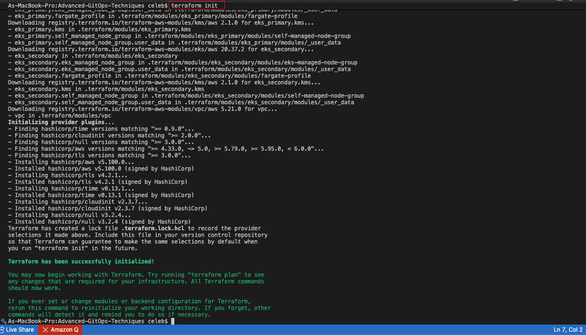
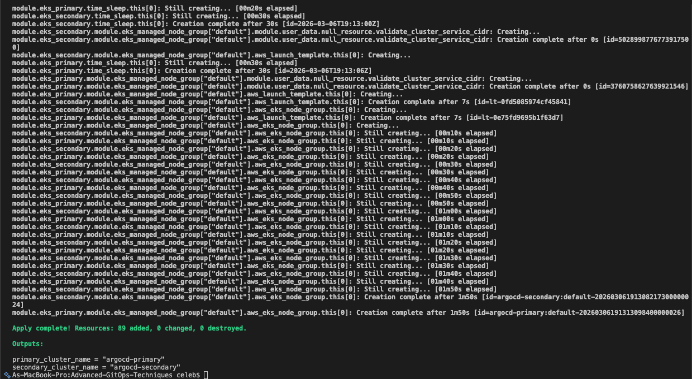
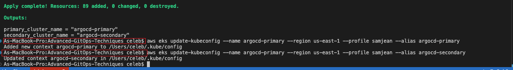
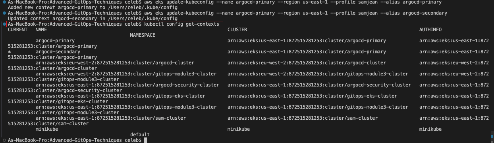
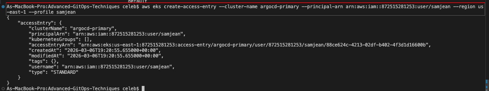
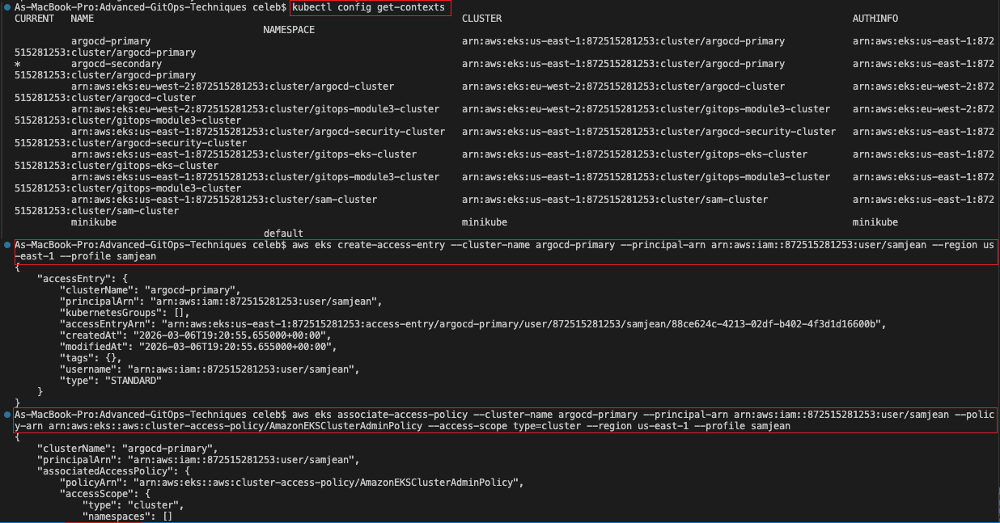
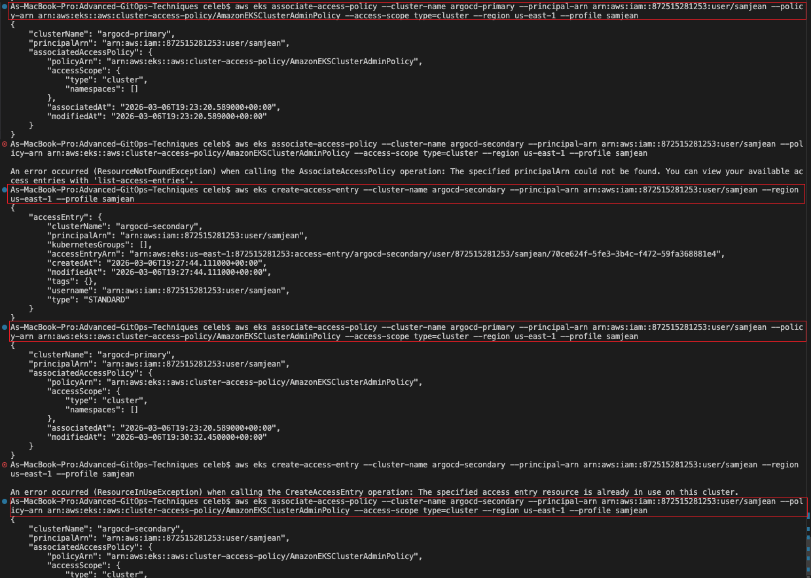
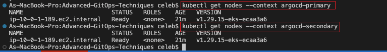
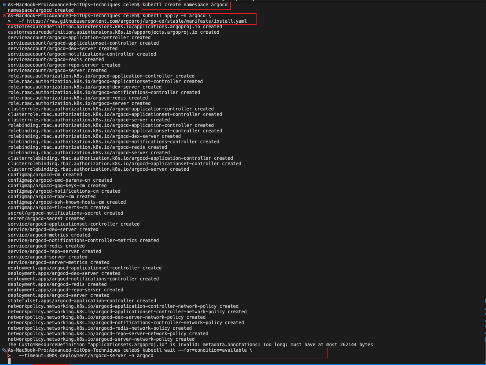
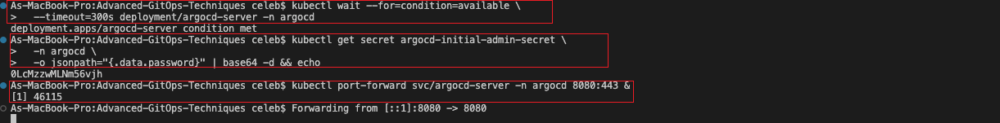
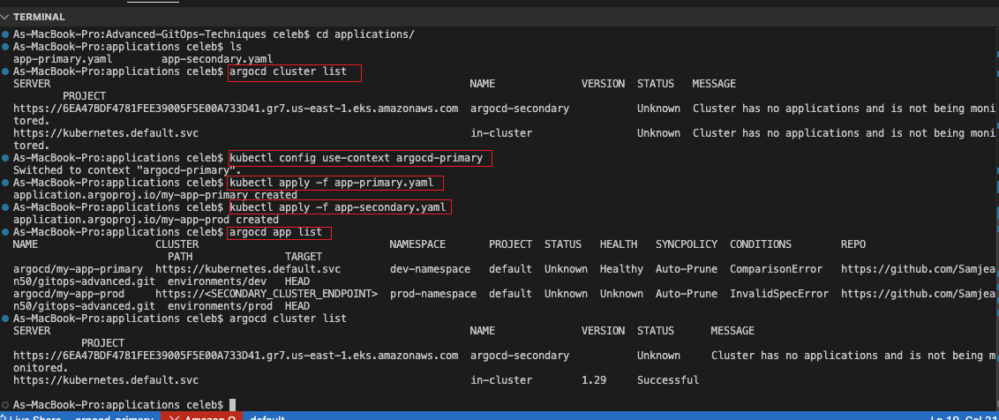
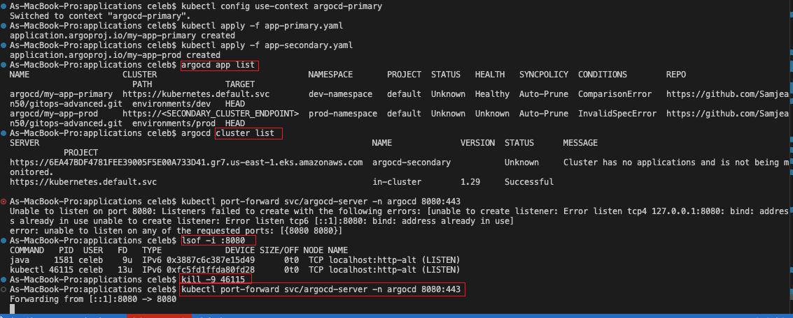
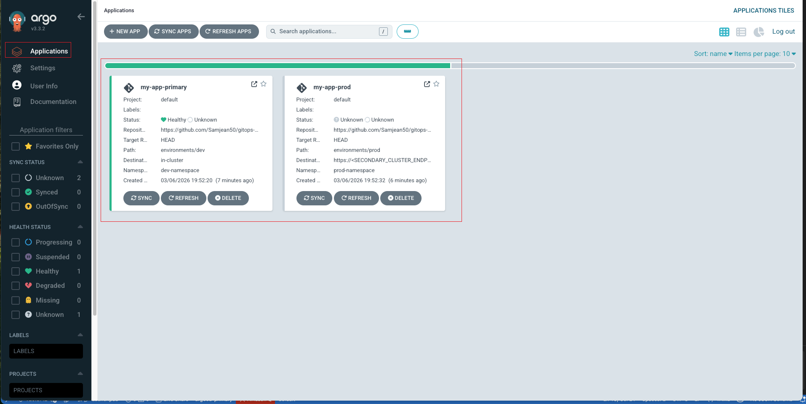
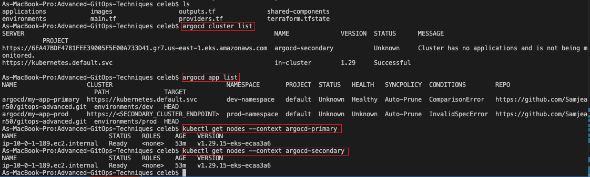
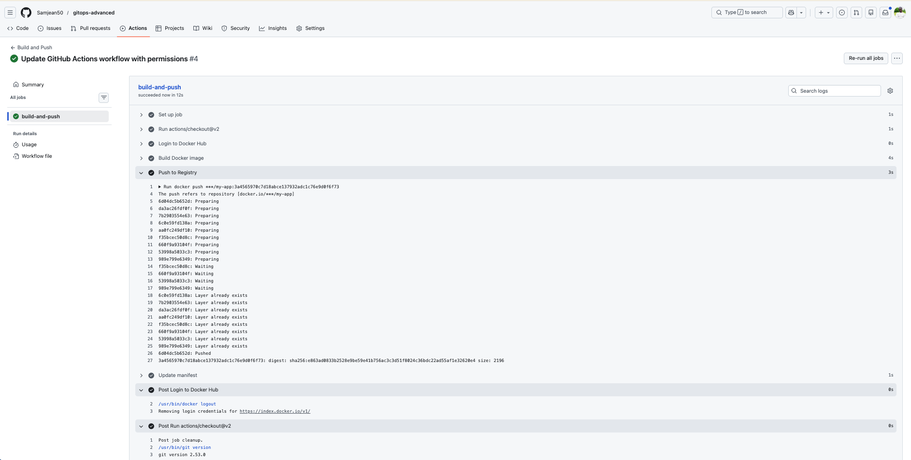
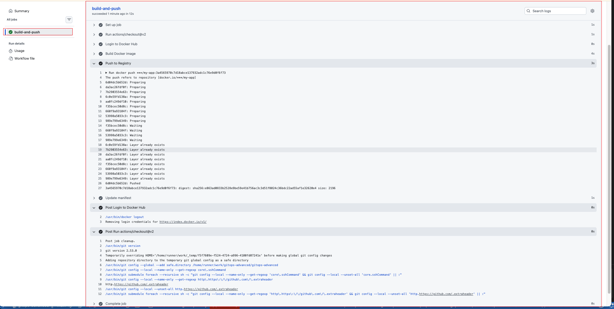
!