# GitOps Security and Access Control in ArgoCD

## Project Overview
This project focuses on securing ArgoCD in a GitOps environment by implementing access control, authentication, and auditing mechanisms. It demonstrates how to protect ArgoCD using industry-standard security practices suitable for real-world and enterprise deployments.

The module is structured into three lessons that together form a complete security lifecycle:

- Authorization (RBAC)
- Authentication (OAuth / SSO)
- Auditing and Compliance

## Architecture Overview

- **Cloud Provider:** AWS (us-east-1)
- **Kubernetes:** EKS (v1.29) with managed node groups
- **GitOps Tool:** ArgoCD
- **IaC:** Terraform (VPC + EKS provisioning)
- **Auth:** Google OAuth via ArgoCD Dex


## Project Structure

```
gitops-security-access-control/
├── terraform/
│   ├── main.tf              # VPC and EKS cluster definitions
│   ├── providers.tf         # AWS, Helm, Kubernetes providers
│   └── argocd.tf            # ArgoCD Helm release
├── argocd-rbac.yaml         # RoleBinding for ArgoCD server
├── argocd-cm.yaml           # ConfigMap for OAuth + audit log config
└── argocd-rbac-cm.yaml      # RBAC policy for user roles
```

---


## Learning Objectives
By completing this module, you will be able to:

- Implement Role-Based Access Control (RBAC) in ArgoCD
- Secure ArgoCD access using OAuth and Single Sign-On (SSO)
- Enable audit trails for traceability and compliance
- Apply GitOps security best practices in production scenarios

## Module Structure
* Lesson 4.1: Implementing Role-Based Access Control (RBAC) in ArgoCD
* Lesson 4.2: Securing ArgoCD with Authentication Strategies (OAuth, SSO)
* Lesson 4.3: Audit Trails and Compliance Strategies in ArgoCD
* Lesson 4.1: Implementing Role-Based Access Control (RBAC) in ArgoCD

## RBAC Overview
Role-Based Access Control (RBAC) in ArgoCD is a security mechanism that controls who can access ArgoCD resources and what actions they are allowed to perform. RBAC ensures that only authorized users or service accounts can interact with applications and configurations.

RBAC helps to:

* Enforce least-privilege access
* Reduce the risk of unauthorized changes
* Separate responsibilities between teams
* Improve auditability and governance

## Roles in ArgoCD
1. Admin Role
Full control over ArgoCD
Create, update, and delete applications
Manage repositories, clusters, and configurations
Grant or revoke access to users
2. Developer Role
Restricted permissions compared to Admins
Can manage and deploy assigned applications
Cannot modify global ArgoCD settings
3. Viewer Role
Read-only access
Can view application status and configurations
Cannot perform changes


## Infrastructure Provisioning (Terraform)

```bash
cd terraform
terraform init
terraform apply -auto-approve
```

This provisions:
- A VPC with public and private subnets across 2 AZs
- An EKS cluster with `t3.medium` managed node groups
- Public + private API endpoint access enabled

After provisioning:

```bash
aws eks update-kubeconfig \
  --name argocd-security-cluster \
  --region us-east-1 \
  --profile samjean

kubectl get nodes
```

---


## Task 1: Create RBAC Configuration
In this step, Kubernetes RBAC is configured to define what the ArgoCD server is allowed to do within the cluster.

Create argocd-rbac.yaml
```
apiVersion: rbac.authorization.k8s.io/v1
kind: RoleBinding
metadata:
  name: argocd-cluster-admin
  namespace: argocd
subjects:
  - kind: ServiceAccount
    name: argocd-server
    namespace: argocd
roleRef:
  kind: ClusterRole
  name: cluster-admin
  apiGroup: rbac.authorization.k8s.io
```

## RBAC Configuration Explanation
- apiVersion: Kubernetes RBAC API version
- kind: Resource type (RoleBinding)
- metadata: Name and namespace of the RoleBinding
- subjects: Entity receiving permissions (argocd-server ServiceAccount)
- roleRef: Referenced role (cluster-admin)
  
* Security Note: cluster-admin is suitable for learning or lab environments. In production, always define custom roles with least-privilege permissions.

## Task 2: Apply RBAC Configuration
kubectl apply -f argocd-rbac.yaml
This command creates the RoleBinding based on the configuration provided.

## Task 3: Verify RBAC Configuration
kubectl get rolebinding -n argocd
If successful, argocd-cluster-admin will be listed, confirming that RBAC has been applied correctly.

## Lesson 4.1 Outcome
- RBAC concepts understood
- Kubernetes RBAC configured for ArgoCD
- Authorization controls successfully applied


## Lesson 4.2: Securing ArgoCD with Authentication Strategies (OAuth, SSO)
1. OAuth Overview
OAuth (Open Authorization) is a framework that allows applications to authenticate users without exposing credentials. ArgoCD uses OAuth through Dex to integrate with external identity providers.

OAuth enables:

- Single Sign-On (SSO)
- Centralized identity management
- Mapping external users and groups to ArgoCD roles
2. Create OAuth Configuration

Create argocd-oauth.yaml
```
apiVersion: argoproj.io/v1alpha1
kind: ArgoCD
metadata:
  name: argocd
spec:
  server:
    route:
      hosts:
        - argocd.example.com
    tls:
      insecureEdgeTerminationPolicy: Redirect
  dex:
    config:
      connectors:
        - type: oidc
          id: oauth
          name: OAuth
          config:
            issuer: https://accounts.google.com
            clientID: <YOUR_GOOGLE_CLIENT_ID>
            clientSecret: <YOUR_GOOGLE_CLIENT_SECRET>
            redirectURI: https://argocd.example.com/auth/callback
```


## Lesson 4.1: RBAC Configuration

### Grant IAM User Cluster Access

```bash
aws eks create-access-entry \
  --cluster-name argocd-security-cluster \
  --principal-arn arn:aws:iam::<ACCOUNT_ID>:user/samjean \
  --region us-east-1 --profile samjean

aws eks associate-access-policy \
  --cluster-name argocd-security-cluster \
  --principal-arn arn:aws:iam::<ACCOUNT_ID>:user/samjean \
  --policy-arn arn:aws:eks::aws:cluster-access-policy/AmazonEKSClusterAdminPolicy \
  --access-scope type=cluster \
  --region us-east-1 --profile samjean
```

### Install ArgoCD

```bash
kubectl create namespace argocd
kubectl apply -n argocd \
  -f https://raw.githubusercontent.com/argoproj/argo-cd/stable/manifests/install.yaml

kubectl wait --for=condition=available \
  --timeout=300s deployment/argocd-server -n argocd
```

### Apply RBAC RoleBinding

`argocd-rbac.yaml`:

```yaml
apiVersion: rbac.authorization.k8s.io/v1
kind: RoleBinding
metadata:
  name: argocd-cluster-admin
  namespace: argocd
subjects:
  - kind: ServiceAccount
    name: argocd-server
roleRef:
  kind: ClusterRole
  name: cluster-admin
  apiGroup: rbac.authorization.k8s.io
```

```bash
kubectl apply -f argocd-rbac.yaml
kubectl get rolebinding -n argocd
```

---

## Lesson 4.2: OAuth Authentication


## OAuth Configuration Explanation

Create a Google OAuth app at [console.cloud.google.com](https://console.cloud.google.com):
- Application type: **Web application**
- Authorised redirect URI: `https://localhost:8080/auth/callback`

`argocd-cm.yaml`:

```yaml
apiVersion: v1
kind: ConfigMap
metadata:
  name: argocd-cm
  namespace: argocd
  labels:
    app.kubernetes.io/name: argocd-cm
    app.kubernetes.io/part-of: argocd
data:
  url: https://localhost:8080
  logFormat: "text"
  dex.config: |
    connectors:
      - type: oidc
        id: google
        name: Google
        config:
          issuer: https://accounts.google.com
          clientID: <YOUR_CLIENT_ID>
          clientSecret: <YOUR_CLIENT_SECRET>
          redirectURI: https://localhost:8080/auth/callback
```

```bash
kubectl apply -f argocd-cm.yaml
kubectl rollout restart deployment/argocd-server -n argocd
```

### Authorise Your Gmail as Admin

`argocd-rbac-cm.yaml`:

```yaml
apiVersion: v1
kind: ConfigMap
metadata:
  name: argocd-rbac-cm
  namespace: argocd
data:
  policy.csv: |
    g, your-email@gmail.com, role:admin
  policy.default: role:readonly
```

```bash
kubectl apply -f argocd-rbac-cm.yaml
kubectl rollout restart deployment/argocd-server -n argocd
```

- issuer: OAuth provider URL
- clientID / clientSecret: Credentials from the OAuth provider
- redirectURI: Callback URL after successful authentication

3. Apply OAuth Configuration
```kubectl apply -f argocd-oauth.yaml```

Restart the ArgoCD server if required:

```kubectl rollout restart deployment argocd-server -n argocd```

4. Verify OAuth Authentication

```bash
kubectl port-forward svc/argocd-server -n argocd 8080:443
```

Visit `https://localhost:8080` — you should see the **Log in via Google** button.

- Open the ArgoCD UI at https://argocd.example.com
- Select Login via OAuth
- Authenticate using the configured provider
- Successful login confirms OAuth and SSO are working correctly.

## Lesson 4.2 Outcome
- OAuth authentication enabled
- SSO integrated with ArgoCD
- External identity provider configured

## Lesson 4.3: Audit Trails and Compliance Strategies in ArgoCD

The `logFormat: "text"` field in `argocd-cm.yaml` enables structured audit logging.

### Verify Audit Logs

```bash
# Get ArgoCD server pod name
kubectl get pods -n argocd | grep argocd-server

# Stream logs
kubectl logs -n argocd -l app.kubernetes.io/name=argocd-server -f
```

Trigger activity by logging in via the UI at `https://localhost:8080` — you will see timestamped audit entries in the log output.


### Lesson Objectives
- Track user and system actions in ArgoCD
- Support security audits and investigations
- Meet compliance and governance requirements

1. Audit Logging Overview
Audit logs capture important events such as:

- Application changes
- Sync operations
- Authentication and authorization events
- Configuration updates

2. Configure Audit Logging
```
apiVersion: argoproj.io/v1alpha1
kind: ArgoCD
metadata:
  name: argocd
spec:
  server:
    config:
      url: https://argocd.example.com
      logFormat: "text"

```
⚠️ Best Practice: Use json format in production for easier log aggregation and analysis.

3. Compliance Strategies
- Store ArgoCD configuration as code in Git
- Perform regular RBAC and access reviews
- Integrate logs with centralized logging or SIEM tools
- Enforce change control via pull requests

4. Verify Audit Logs
```kubectl logs -n argocd <argocd-server-pod-name>```
Confirm that audit-related events are present in the logs.

## Lesson 4.3 Outcome
- Audit logging enabled
- Compliance strategies applied
- Improved traceability and accountability

# Module 4 Completion Summary
In this module, you have successfully:

- Implemented RBAC for ArgoCD authorization
- Secured authentication using OAuth and SSO
- Enabled audit trails and compliance controls

This module provides a production-ready GitOps security foundation for ArgoCD deployments.

# Module 4 – Security and Access Control in ArgoCD (Finalized)

# Step-by-Step Execution of Project
This section provides a hands-on execution guide for implementing RBAC and authentication security in ArgoCD as described in this module.

# Prerequisites
Ensure the following are already in place before proceeding:

- A running Kubernetes cluster
- ArgoCD installed in the argocd namespace
- kubectl configured and connected to the cluster
- Cluster-admin access for initial setup

Verify ArgoCD installation:

```kubectl get pods -n argocd```

All ArgoCD pods should be in a Running state.

* Step 1: Understand the Default ArgoCD Access Model
By default:

- ArgoCD uses an admin account with full privileges
- No fine-grained access control is enforced
- RBAC will be introduced to restrict access based on roles.

* Step 2: Create the RBAC Configuration File
- Create a file named argocd-rbac.yaml:

```nano argocd-rbac.yaml```
Add the following content:

```
apiVersion: rbac.authorization.k8s.io/v1
kind: RoleBinding
metadata:
  name: argocd-cluster-admin
  namespace: argocd
subjects:
  - kind: ServiceAccount
    name: argocd-server
    namespace: argocd
roleRef:
  kind: ClusterRole
  name: cluster-admin
  apiGroup: rbac.authorization.k8s.io

```
- Save and exit the file.

* Step 3: Apply the RBAC Configuration
Apply the RoleBinding to the cluster:

```kubectl apply -f argocd-rbac.yaml```

Expected output:

rolebinding.rbac.authorization.k8s.io/argocd-cluster-admin created
This grants the ArgoCD server controlled access to cluster resources.

* Step 4: Verify the RBAC Configuration
- Confirm the RoleBinding was created successfully:

```kubectl get rolebinding -n argocd```

Describe the binding for detailed inspection:

kubectl describe rolebinding argocd-cluster-admin -n argocd
You should see the argocd-server service account bound to the cluster-admin role.

* Step 5: Validate ArgoCD Application Access
- Log in to the ArgoCD UI

- Navigate to Applications

- Confirm ArgoCD can:

  - Sync applications
  - Read cluster resources
  - Deploy manifests
- Check ArgoCD server logs if issues occur:

```kubectl logs deployment/argocd-server -n argocd```

* Step 6: Configure OAuth / SSO Authentication (Conceptual)
⚠️ OAuth configuration depends on the chosen identity provider (GitHub, Google, Keycloak).

* High-level steps:

- Register ArgoCD as an OAuth application with the provider

* Obtain:

- Client ID
- Client Secret
- Update the ArgoCD ConfigMap (argocd-cm)

* Restart ArgoCD server

Example (GitHub OAuth – conceptual):

```
data:
  url: https://argocd.example.com
  dex.config: |
    connectors:
    - type: github
      id: github
      name: GitHub
      config:
        clientID: <CLIENT_ID>
        clientSecret: <CLIENT_SECRET>
        orgs:
        - name: my-org
```

* Step 7: Restart ArgoCD Components
Apply changes and restart ArgoCD:

```
kubectl rollout restart deployment argocd-server -n argocd
kubectl rollout restart deployment argocd-repo-server -n argocd
```

* Step 8: Confirm Secure Access
- Verify login via OAuth provider
- Ensure RBAC restrictions apply
- Confirm users only see permitted applications


# Summary
successfully:

- Implemented Kubernetes RBAC for ArgoCD
- Secured cluster access
- Prepared ArgoCD for OAuth-based authentication
- Verified access control enforcement

### Compliance Strategies

- All ArgoCD config is version-controlled in Git (GitOps by default)
- Enable AWS CloudTrail to capture Kubernetes API calls on EKS
- Use `kubectl get events -n argocd` for in-cluster compliance checks
- Integrate with a SIEM (AWS Security Hub, Datadog, or Splunk) for centralised audit storage

---

## Cleanup

```bash
cd terraform
terraform destroy -auto-approve

# Clean up local kubeconfig
kubectl config delete-context <cluster-context>

# Kill port forwards
pkill -f "kubectl port-forward"
```

# STEPS TAKEN
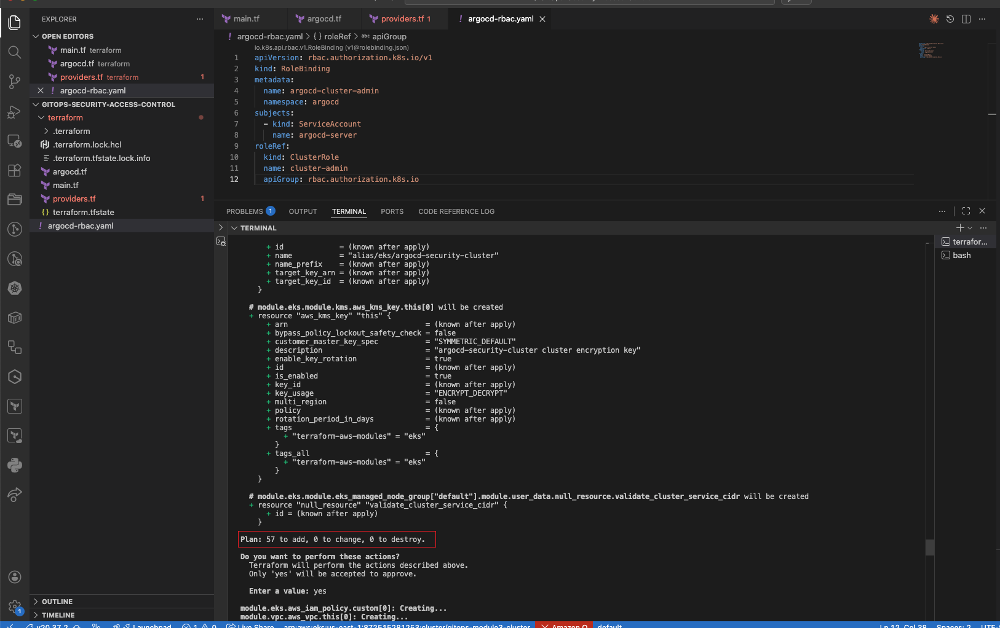
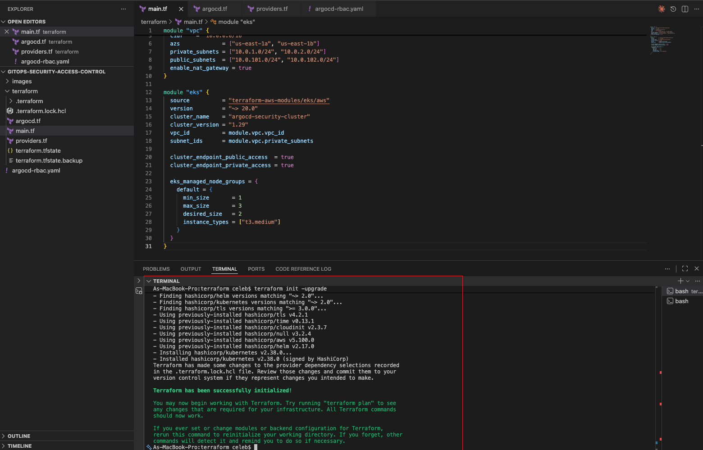
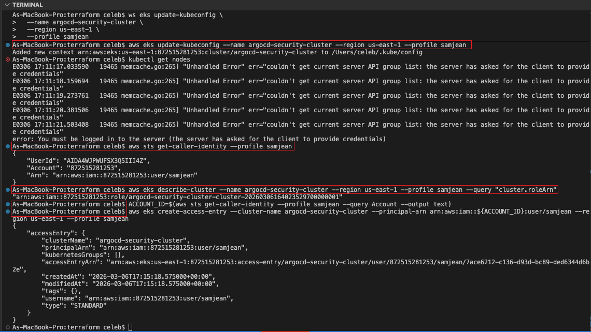
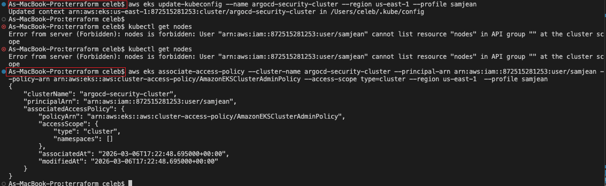
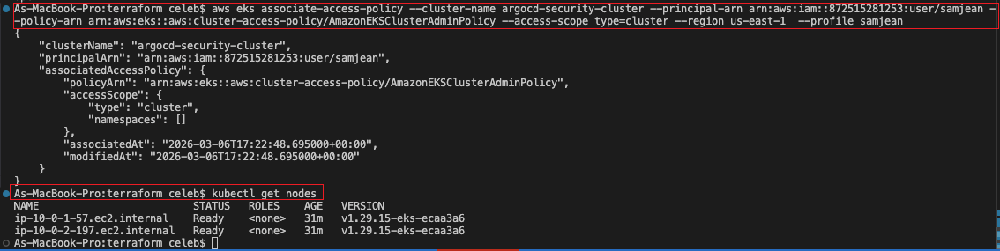
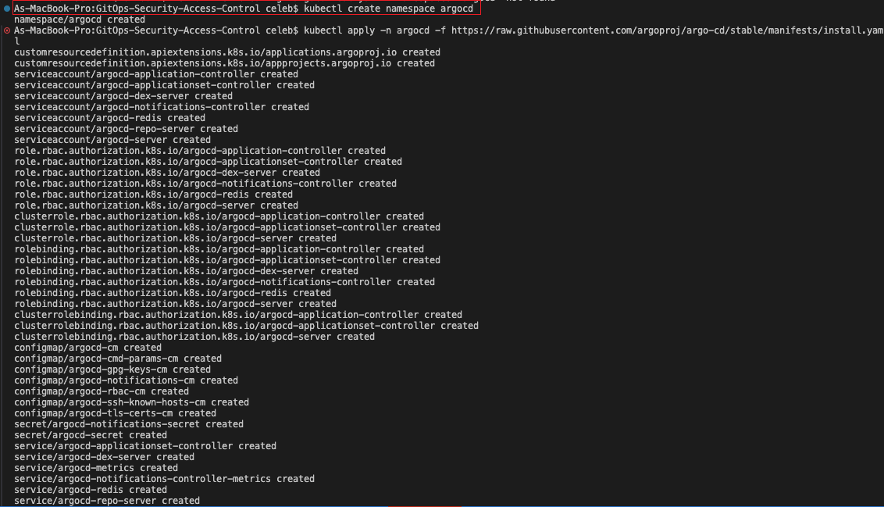
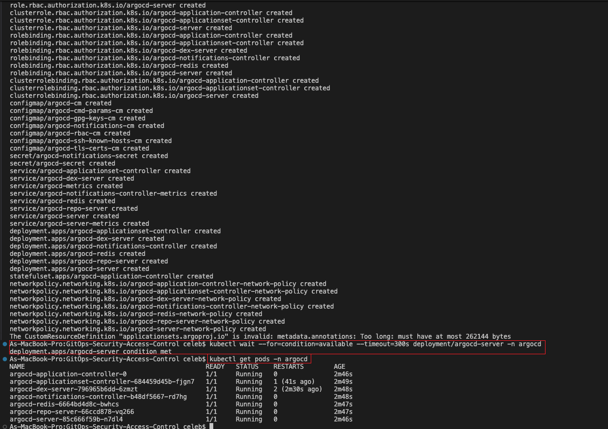
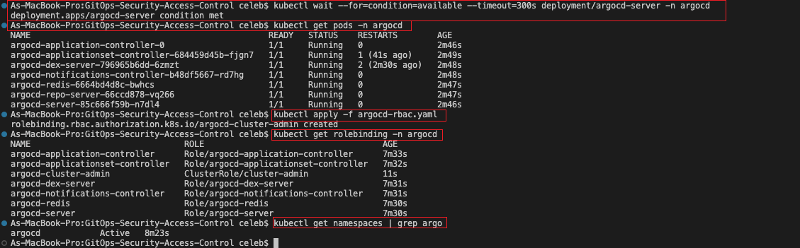
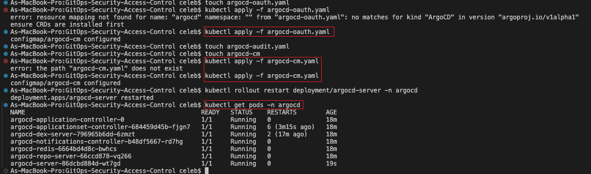
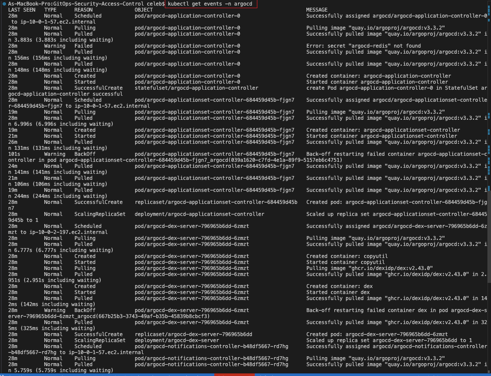
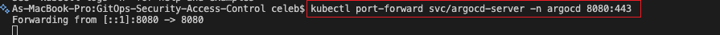
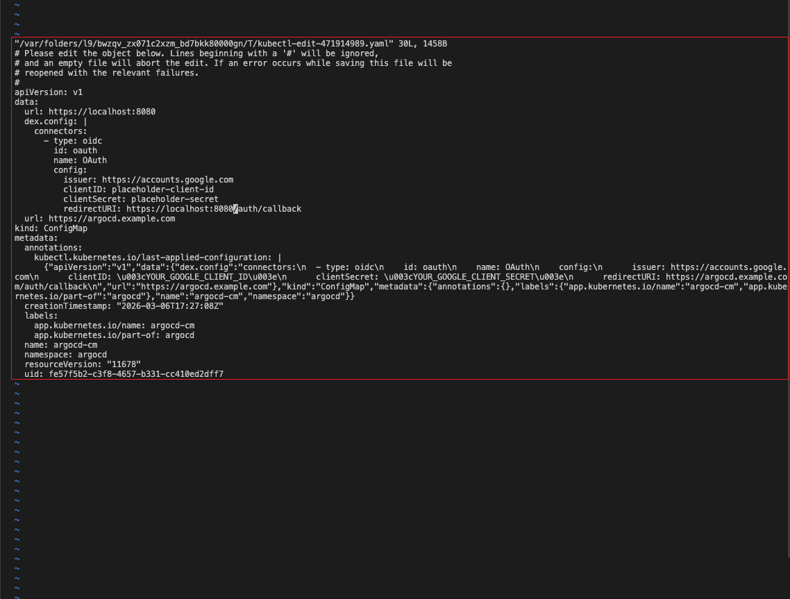
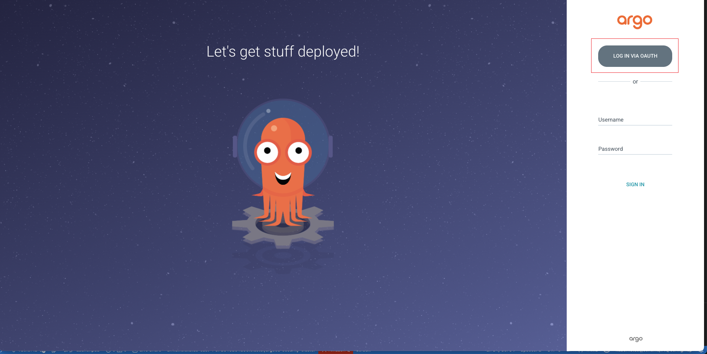
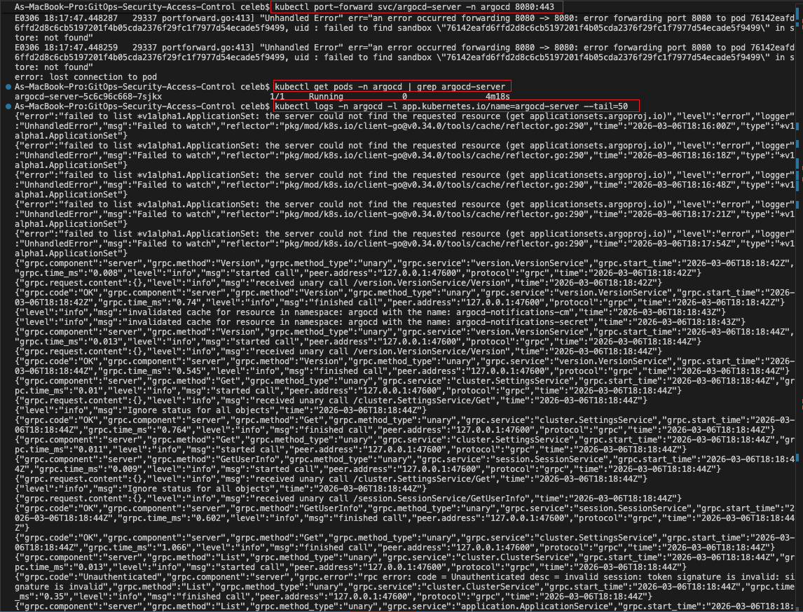
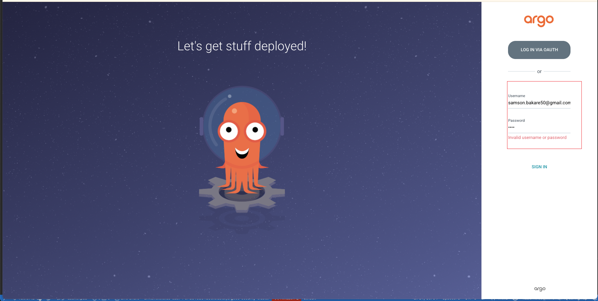
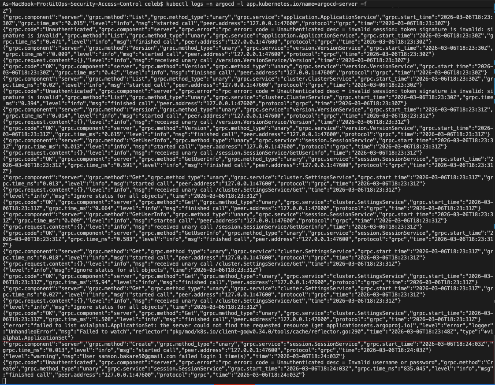
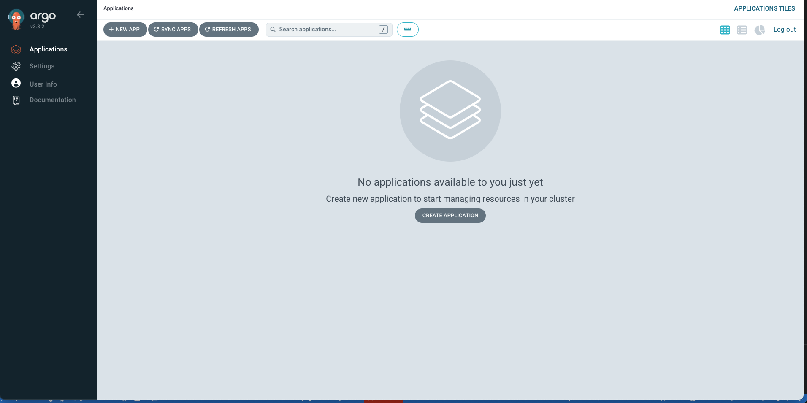
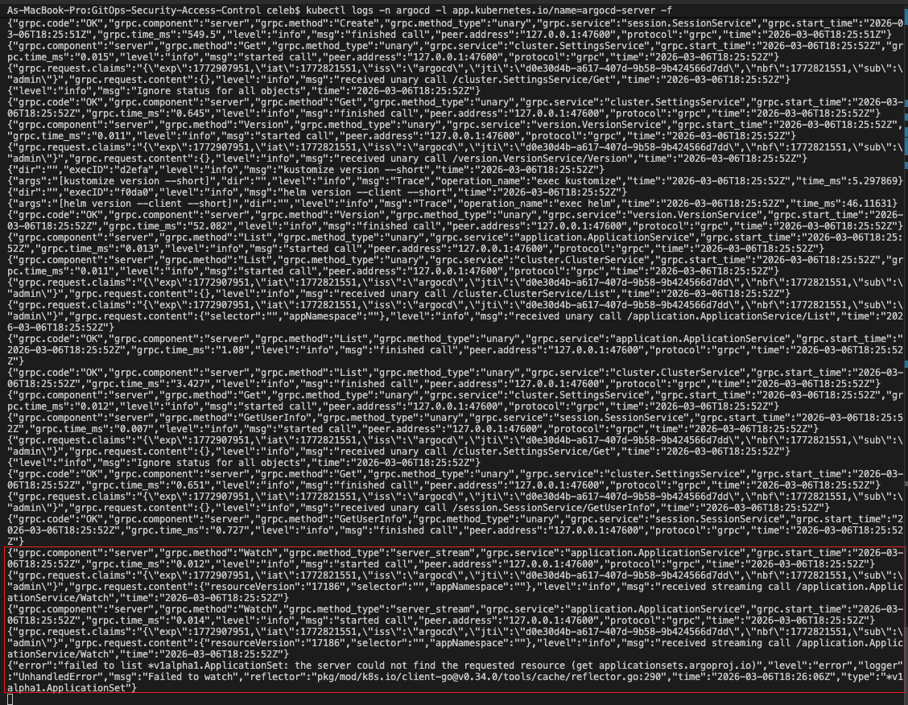
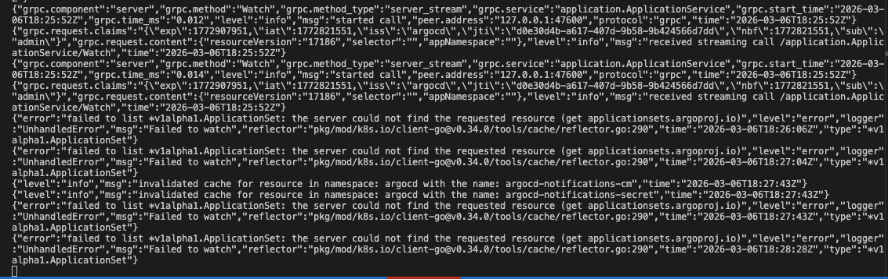
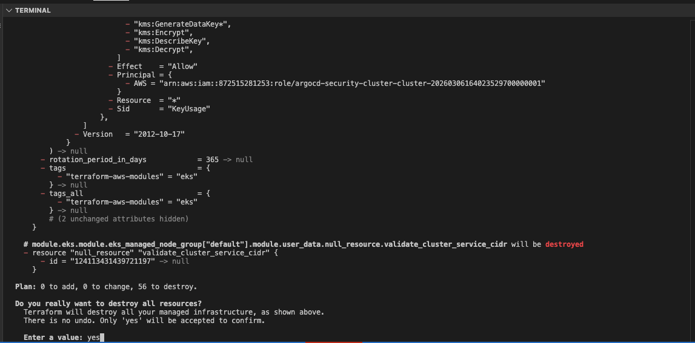

