# Introduction to GitOps and ArgoCD Using AWS
# Project Overview
This project introduces learners to GitOps using ArgoCD, specifically within a Kubernetes environment hosted on AWS (Amazon Web Services).
You will learn the principles of GitOps, install ArgoCD on an AWS-managed EKS cluster, and explore ArgoCD’s architecture and components.

# Introduction
Welcome to your journey into the world of GitOps using ArgoCD on Amazon EKS!

This project equips you with essential skills to implement modern DevOps practices.
By understanding GitOps principles and leveraging ArgoCD, you will learn how to build a more reliable, automated, and scalable cloud-native delivery workflow.

The course is structured to guide you through:

* GitOps concepts
* ArgoCD’s role in Kubernetes
* Deploying ArgoCD on AWS EKS
* Understanding ArgoCD’s architecture
* Deploying and managing applications

# Pre-Requisites
1. Basic Understanding of Kubernetes
Concepts: Pods, Deployments, Services
Resource: Kubernetes Basics
2. AWS Account
Required to create and manage the EKS cluster
Sign up if needed.
3. Amazon EKS Cluster
A functional EKS cluster
Create via AWS Console or AWS CLI.
4. Kubectl
Kubernetes command-line tool
Install and configure it.
5. AWS CLI
Required for EKS, IAM, and cluster authentication
Install AWS CLI v2.
6. Git
Used for version control and managing your manifests
You should understand: clone, commit, push, merge.
7. ArgoCD Concepts
Familiarity with ArgoCD’s role in GitOps
Reference: ArgoCD – GitOps for Kubernetes
8. Text Editor / IDE
Options include:

VS Code
Sublime Text
Atom
9. Docker (Optional but Recommended)
For building containerized apps.

10. Helm & Kustomize
Kubernetes package management tools.

11. Internet Connection
Needed for AWS, GitHub, documentation, etc.

12. Hardware Requirements
At least 8GB RAM recommended.

# Lesson 1.1 — GitOps Principles and Role of ArgoCD
🎯 Objective
Understand GitOps principles and how ArgoCD implements them in Kubernetes.

# GitOps Principles
# Key Concepts

* Infrastructure as Code (IaC):
Infrastructure is managed through code, not manual processes.

* Automated Deployment:
Deployments become predictable, repeatable, and consistent.

* Merge Requests for Change Management:
All changes flow through Git PRs, ensuring traceability.

# Benefits of GitOps
- Improved developer productivity
- Enhanced stability (everything is version-controlled)
- Easier recovery (rollback to previous state anytime)

# Recommended Reading
Weaveworks GitOps Principles — a deeper dive into the foundations of GitOps.

# Role of ArgoCD in GitOps
* What ArgoCD Does
- Automates Kubernetes deployments by monitoring Git repositories
- Continuously compares desired state (Git) vs live state (cluster)
- Ensures cluster consistency

# Features of ArgoCD
- Declarative setup
- Self-healing (fixes drift automatically)
- Multi-cluster support
- Works with Helm, Kustomize, raw manifests
- Easy rollbacks, visual UI

# Use Cases
- Multi-environment deployments
- Git-based rollbacks
- Progressive delivery

# Lesson 1.2 — Installing & Configuring ArgoCD on AWS EKS
* Objective
Install and access ArgoCD in an AWS EKS cluster.

1. Set Up an EKS Cluster
Create a cluster using:

AWS Console, or
AWS CLI
Follow AWS EKS setup documentation.

2. Install ArgoCD on EKS
Run:
kubectl create namespace argocd
kubectl apply -n argocd -f https://raw.githubusercontent.com/argoproj/argo-cd/stable/manifests/install.yaml
Explanation: Creates the argocd namespace and installs the full ArgoCD stack.

3. Access ArgoCD UI Port-forward approach: kubectl port-forward svc/argocd-server -n argocd 8080:443

Visit: 📌 http://localhost:8080

# Lesson 1.3 — ArgoCD Architecture & Core Components 🎯 Objective

Understand how ArgoCD functions internally and deploy a sample application.

1. ArgoCD Components

- API Server — UI, CLI, RBAC

- Repository Server — Fetches manifests from Git

- Application Controller — Monitors live vs desired state

2. Explore ArgoCD UI

Learn to:

- View applications

- Manage repositories

- Inspect deployment health

- Trigger syncs & rollbacks

3. Deploy a Sample Application

Use a public Git repo containing Kubernetes manifests.

Reference: ArgoCD Deploying Applications Guide

4. Monitor Syncing

ArgoCD will:

- Detect changes

- Apply the new desired state

- Display health and sync status

# Additional Resources

- AWS EKS Documentation

- ArgoCD User Guide

- Weaveworks GitOps Guide

- Hands-on GitOps Tutorials

# STEP-BY-STEP EXECUTION
Below is the practical, command-based execution workflow.

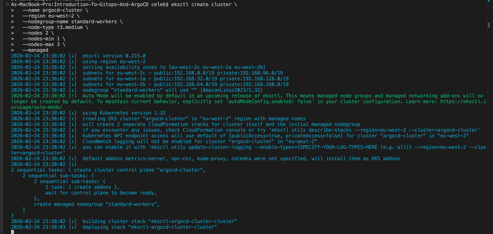
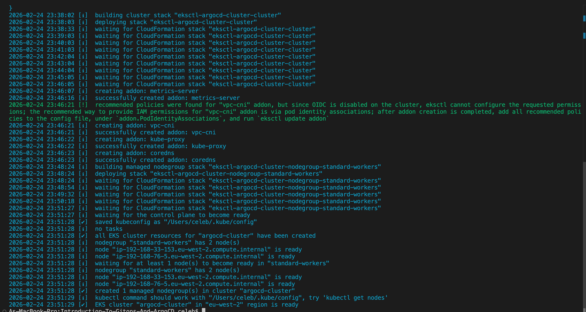
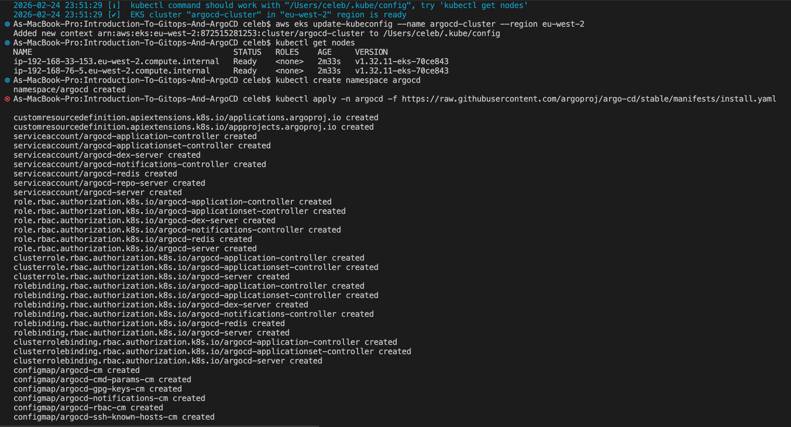
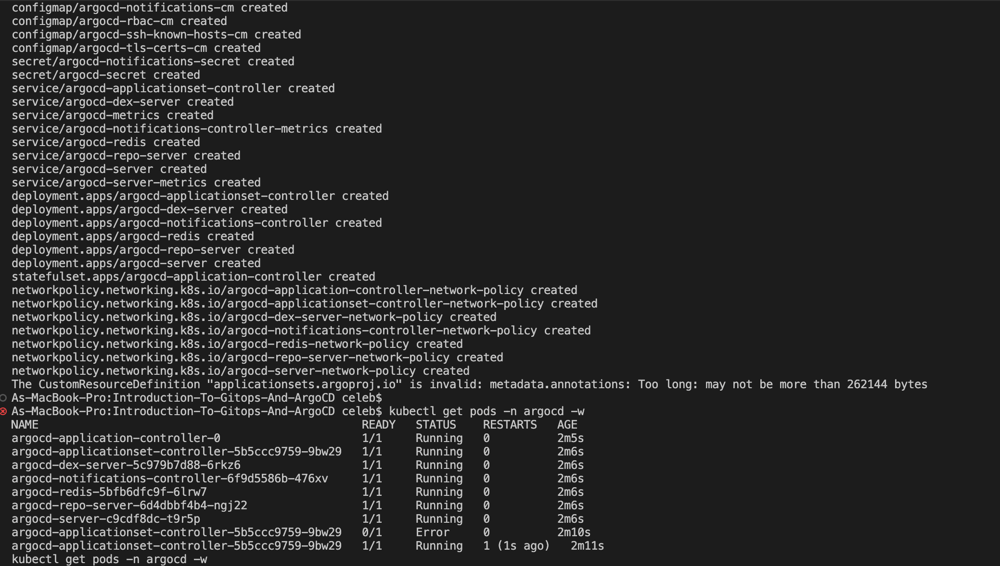
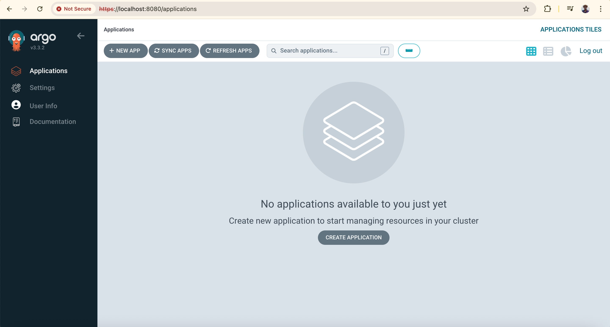
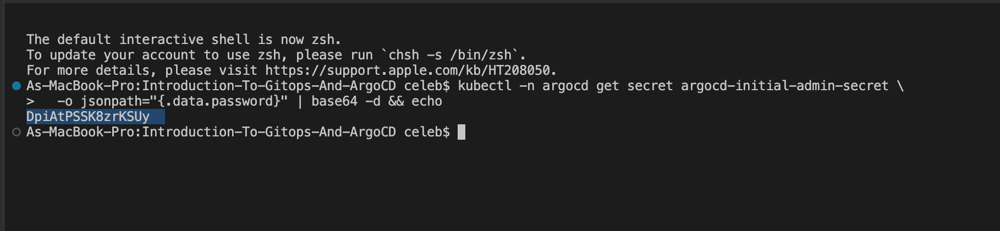
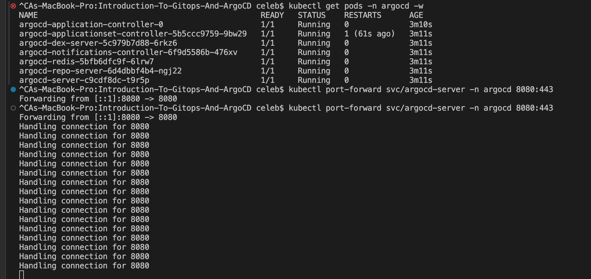
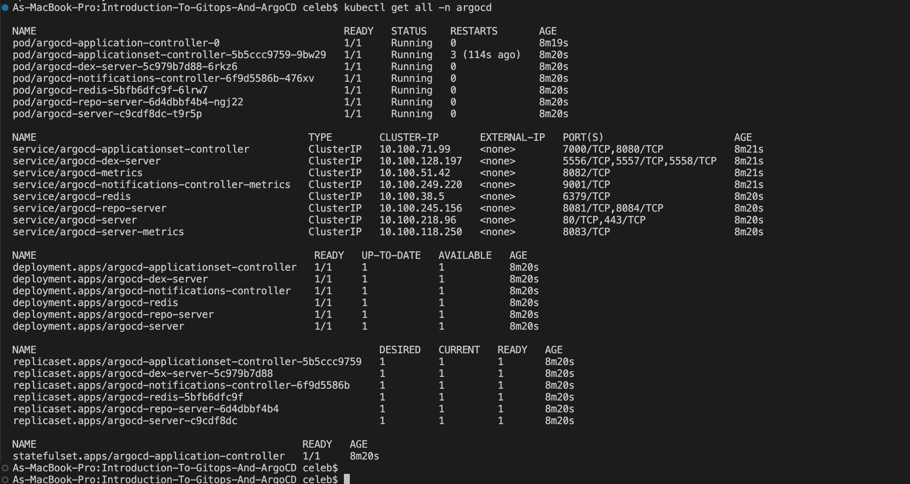
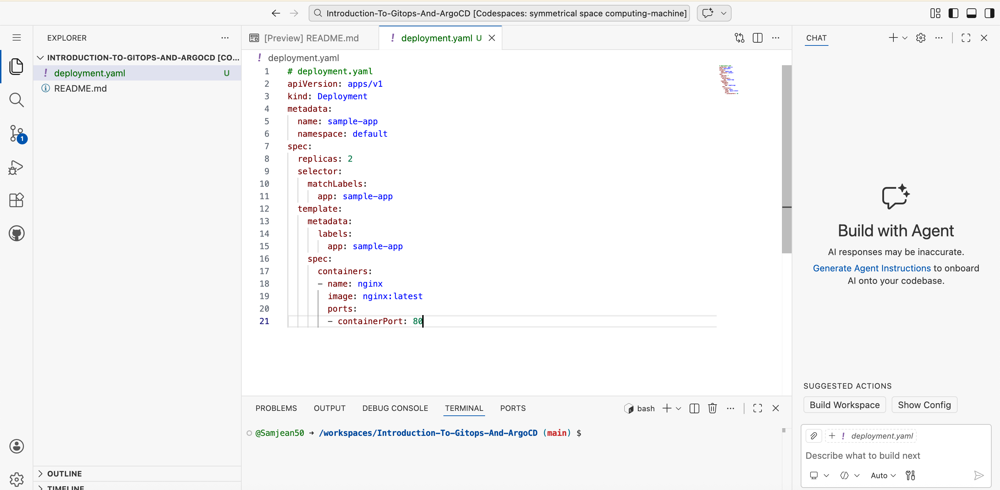
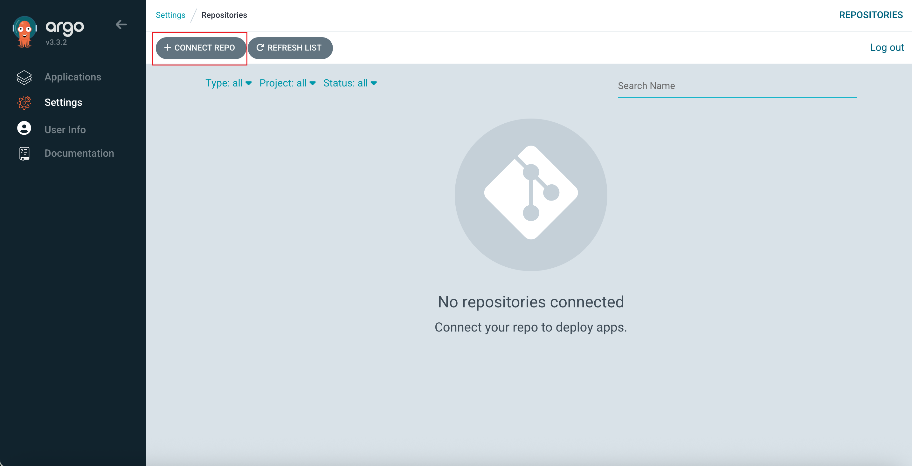
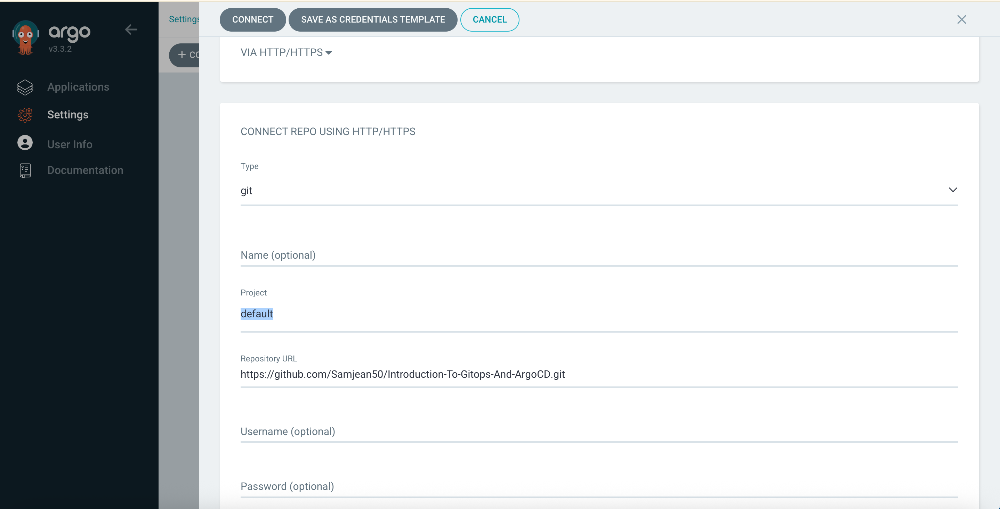
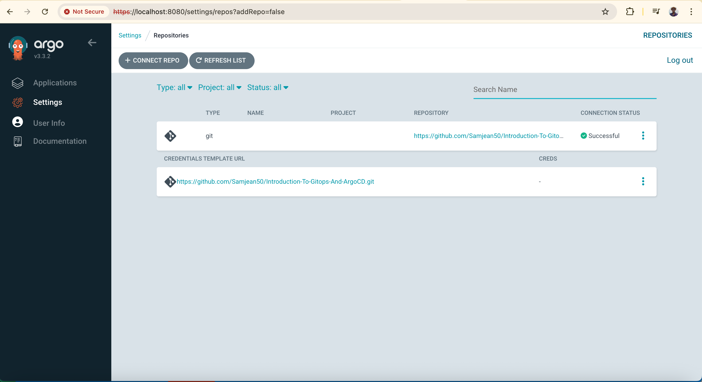
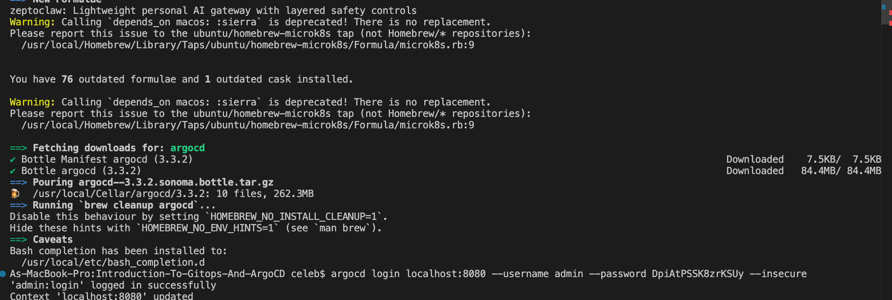
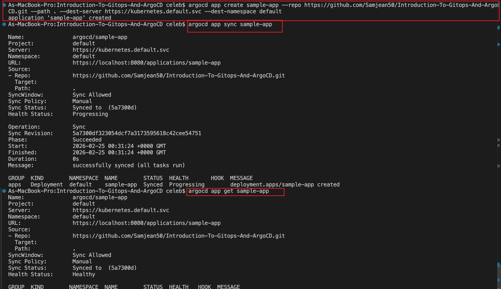
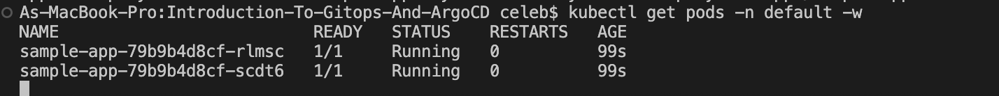
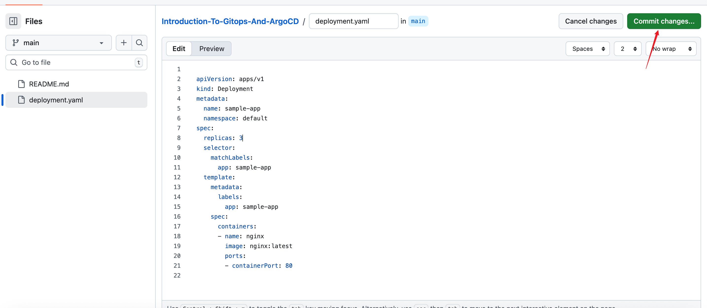
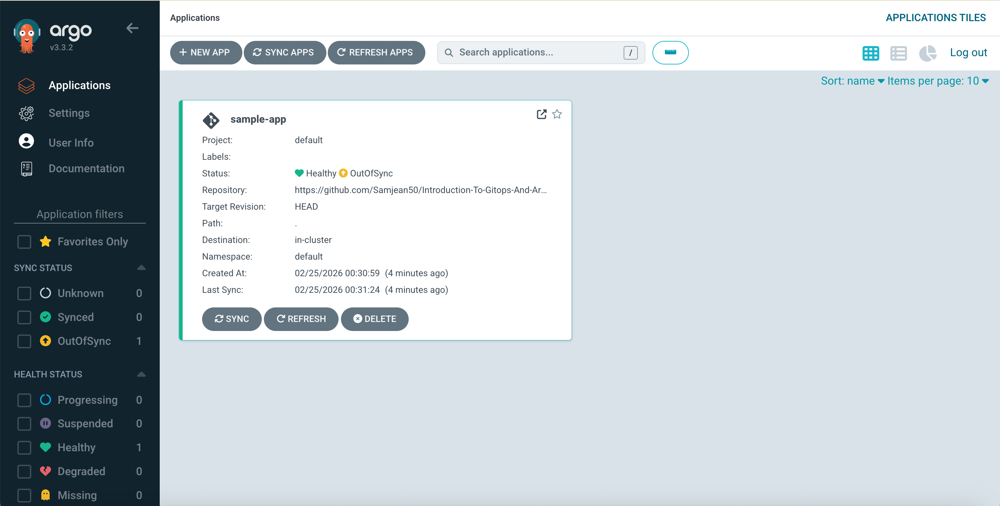
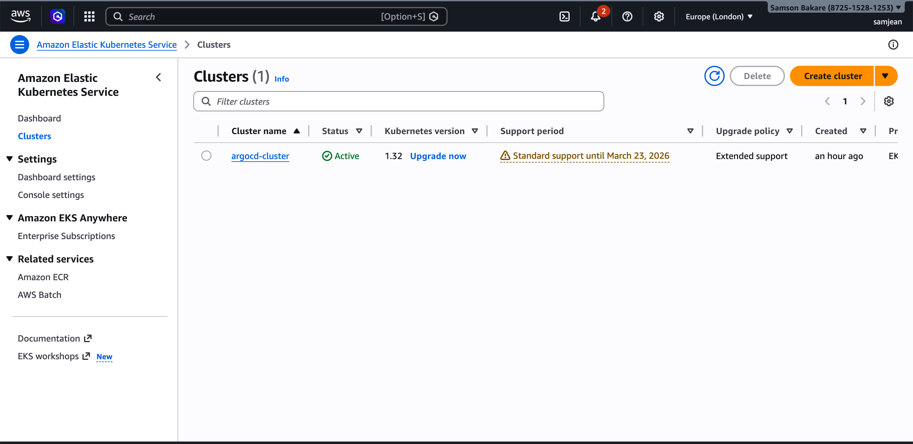
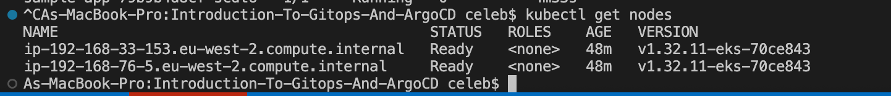
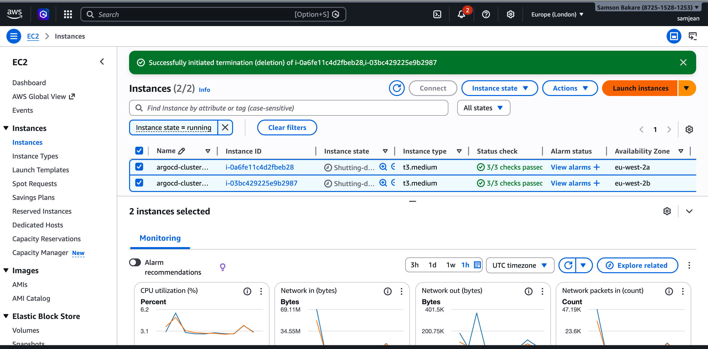
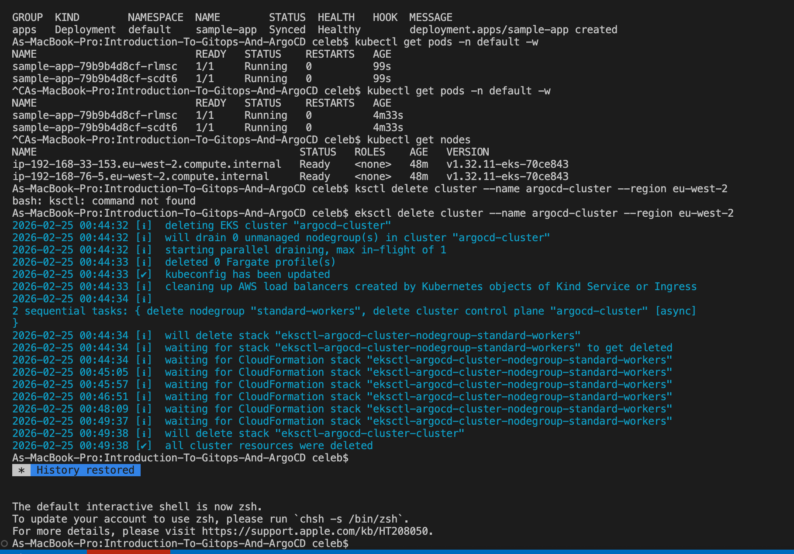

# Install Prerequisites
Install AWS CLI
sudo apt install unzip -y
curl "https://awscli.amazonaws.com/awscli-exe-linux-x86_64.zip" -o "awscliv2.zip"
unzip awscliv2.zip
sudo ./aws/install
aws --version